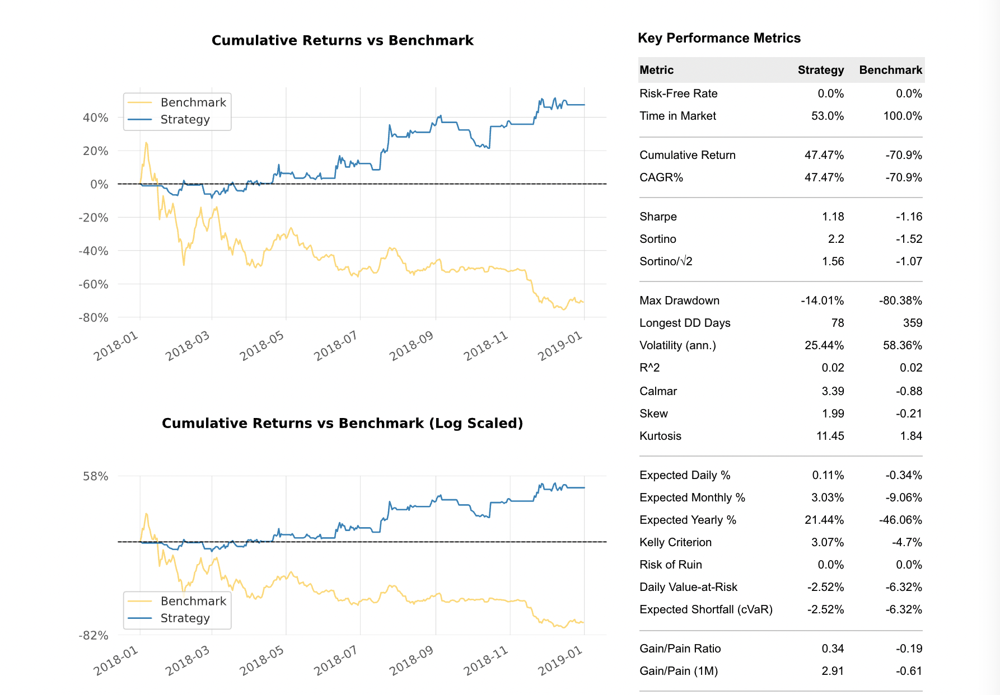
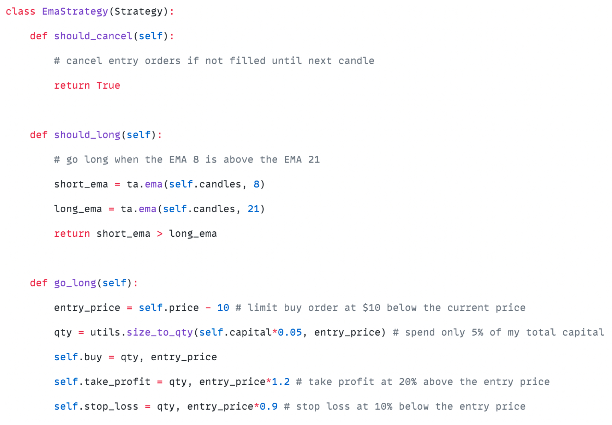
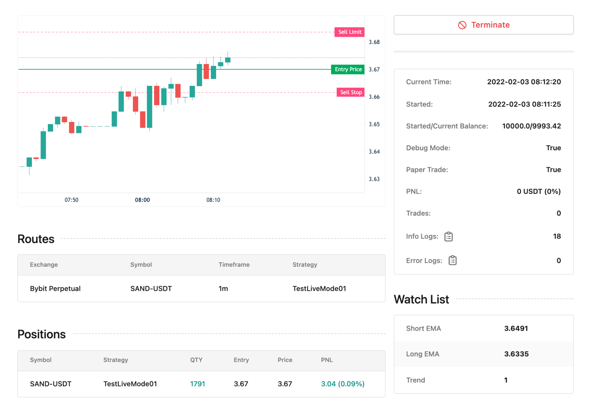

<div align="center">
<br>
<p align="center">

</p>

<p align="center">
Algo-trading was <strong>hard</strong>, we made it <strong>simple</strong>.
</p>
</div>

# Jesse
[](https://pypi.org/project/jesse)
[](https://pepy.tech/project/jesse)
[](https://hub.docker.com/r/salehmir/jesse)
[](https://github.com/jesse-ai/jesse)
[](https://codecov.io/gh/jesse-ai/jesse)

---

[](https://jesse.trade)
[](https://docs.jesse.trade)
[](https://jesse.trade/help)
[](https://jesse.trade/discord)
[](https://jesse.trade/blog)
---
Jesse is an advanced crypto trading framework which aims to **simplify** **researching** and defining **YOUR OWN trading strategies**.

## Why Jesse?
In short, Jesse is more **accurate** than other solutions, and way more **simple**. 
In fact, it is so simple that in case you already know Python, you can get started today, in **matter of minutes**, instead of **weeks and months**. 

**[Here](https://docs.jesse.trade/docs/)** you can read more about Jesse's features and why you should use it. 

## Getting Started
Head over to the "getting started" section of the [documentation](https://docs.jesse.trade/docs/getting-started). The 
documentation is **short yet very informative**. 

## Example Backtest Results

Check out Jesse's [Youtube channel](https://jesse.trade/youtube) for tutorials that go through example strategies step by step. 

Here's a few screenshots just to get you excited:

**Backtest results:**



**Example strategy code:**



**Live trading (requires [live plugin](https://docs.jesse.trade/docs/livetrade.html)):**




## What's next?

You can see the project's **[roadmap here](https://docs.jesse.trade/docs/roadmap.html)**. **Subscribe** to our mailing list at [jesse.trade](https://jesse.trade) to get the good stuff as soon they're released. Don't worry, We won't send you spam. Pinky promise.

## Resources

- [⚡️ Website](https://jesse.trade)
- [🎓 Documentation](https://docs.jesse.trade)
- [🛟 Help center](https://jesse.trade/help)
- [🎥 Youtube channel (screencast tutorials)](https://jesse.trade/youtube)
- [💬 Discord community](https://jesse.trade/discord)

## How to contribute

Thank you for your interest in contributing to the project. The best way to contribute is by **participating in the community** and **helping other users**. 

You can also contribute by submitting **bug reports** and **feature requests** or writing code (submitting PRs) which can be incorporated into Jesse itself.

In that case, here's what you need to know:

- Before starting to work on a PR, please **reach out** to make sure it **aligns** with the **project's roadmap** and **vision**.
- If your PR makes changes to source code, please make sure to **add unit tests**. If you're not sure how to do that, just check out some of the already existing [tests](https://github.com/jesse-ai/jesse/tree/master/tests).

First, you need to install Jesse from the repository instead of PyPi:

```sh
# first, make sure that the PyPi version is not installed
pip uninstall jesse

# now install Jesse from the repository
git clone https://github.com/jesse-ai/jesse.git
cd jesse
pip install -e .
```

Now every change you make to the code will be affected immediately.

After every change, **make sure** your changes did not **break** any functionality by **running tests**:
```
pytest
```

## Disclaimer
This software is for educational purposes only. USE THE SOFTWARE AT **YOUR OWN RISK**. THE AUTHORS AND ALL AFFILIATES ASSUME **NO RESPONSIBILITY FOR YOUR TRADING RESULTS**. **Do not risk money which you are afraid to lose**. There might be **bugs** in the code - this software DOES NOT come with **ANY warranty**.
